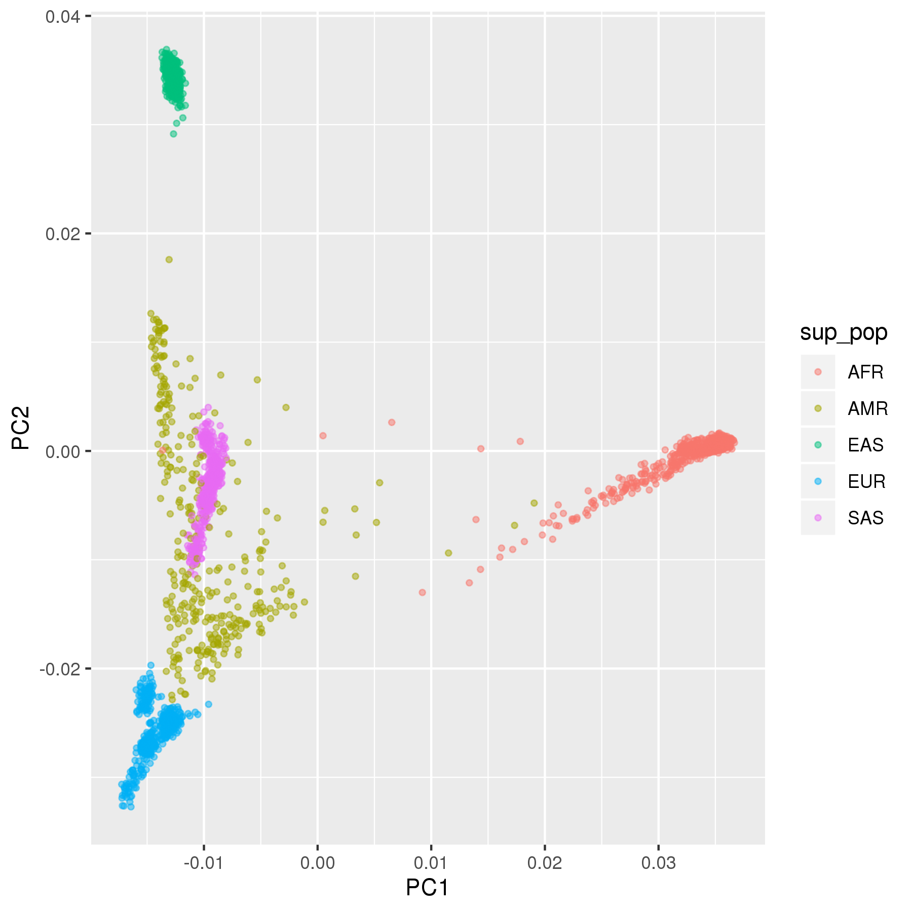

# 2020 FA HPC - Garibaldi (Torque/Maui)

**Author: Shaun Chen**  
**First created: 2020/10/25**

Basic introduction of high-performance computing (HPC) in Scripps Research. This repository worked as class materials and was tested on Garibaldi only. *Shared large datasets will be deprecated at the end of the quarter.*

## Cheat sheet

**Shell commands**  

0. `man`: format and display the on-line manual pages.
0. `ssh`:  OpenSSH SSH client (remote login program).  
0. `htop`: interactive process viewer. (`required_tools/htop`)  
0. `watch`: execute a program periodically, showing output fullscreen.
0. `vim`, `nano`, `emacs`: programmers text editors.
0. `history`: list command history.
0. `exit`: exit the current session.

0. `Ctrl` + `C`: interrupt a running script when you feel not right...  
0. `Ctrl` + `R`: Recall the last command matching the characters you provide.

**Git commands**  

Prerequisite on Garibaldi: `module load git-lfs`

0. `git init`: Create an empty git repository or reinitialize an existing one.  
0. `git clone`: Clone a repository into a new directory.

0. `git status`: Show the working tree status.
0. `git add`: Add file contents to the index.
0. `git commit -m`: Record changes to the repository.
0. `git push`: Update remote refs along with associated objects.

0. `git pull`: Fetch from and merge with another repository or a local branch.

- Note: suggested file size <50MB; limited <100MB.
- Use `.gitignore` to specify intentionally untracked files that Git should ignore.

**Portable batch system (PBS): schedular commands (Torque/Maui)**  

0. `usage`: display the current usage of the entire cluster
0. `qstat`: show status of pbs batch jobs  
		`-f [job_id]`: Specifies that a full status display be written to standard out.  
		`-u [username]`: Specifies all of the user's job status.
0. `qsub`: submit pbs job  
		`-I`: Declares that the job is to be run "interactively".  
		`-l`: Defines the resources that are required by the job and establishes a limit to the amount of resource that can be consumed. i.e. `mem=4gb`, `walltime=4:00:00`, `nodes=1:ppn=1`.  
		`-N`: Declares a name for the job.  
		`-v`: Expands the list of environment variables that are exported to the job. The variable list is a comma separated list of strings of the form variable or variable=value.  
		`-M`: Declares the list of users to whom mail is sent by the execution server when it sends mail about the job.  
		`-m`: Defines the set of conditions under which the execution server will send a mail message about the job.  The mail_options argument is a string which consists of either the single character "n", or one or more of the characters "a", "b", and "e". `a` mail is sent when the job is aborted by the batch system. `b`  mail is sent when the job begins execution. `e`  mail is sent when the job terminates.  
0. `qdel`:  delete pbs batch job

0. `module`: command interface to the Modules package  
		`av`: display all available modules
		`load`: Load modulefile(s) into the shell environment.  
		`unload`:  Remove modulefile(s) from the shell environment.  
		`purge`: Unload all loaded modulefiles.  
		
**Portable batch system (PBS): schedular varaiables (Torque/Maui)**  

0. `$PBS_O_WORKDIR`: Submit directory


## Job script template


## Case study


### Requirements

**Modules and shell tools**  

- R (`module load R`)  
	`ggplot2`
- python >= 3.6.3 (`module load python/3.6.3`)
- [PLINK v2](https://www.cog-genomics.org/plink/2.0/) (`required_tools/plink2`)
- [bcftools >= 1.9](http://samtools.github.io/bcftools/bcftools.html) (`module load samtools`)
- [vcftools >= 0.1.14](http://vcftools.sourceforge.net/) (`module load vcftools`)
- [ADMIXTURE](http://dalexander.github.io/admixture/) (`module load admixture`)  
	_Alexander, David H., and Kenneth Lange. "Enhancements to the ADMIXTURE algorithm for individual ancestry estimation." BMC bioinformatics 12.1 (2011): 246._
- [RFMix2](https://github.com/slowkoni/rfmix) (`required_tools/rfmix2`)  
	_Maples, Brian K., et al. "RFMix: a discriminative modeling approach for rapid and robust local-ancestry inference." The American Journal of Human Genetics 93.2 (2013): 278-288._

**Datasets**  

- Phased 1000 Genomes Phase III as VCF.gz files (post-QCed: `/gpfs/sfchen/work/1000G`)
	[ftp://ftp.1000genomes.ebi.ac.uk/vol1/ftp/release/20130502/](ftp://ftp.1000genomes.ebi.ac.uk/vol1/ftp/release/20130502/)
- 1000 Genomes sample data (`required_tools/1000G.tsv`)
	[http://ftp.1000genomes.ebi.ac.uk/vol1/ftp/technical/working/20130606_sample_info/20130606_sample_info.xlsx](http://ftp.1000genomes.ebi.ac.uk/vol1/ftp/technical/working/20130606_sample_info/20130606_sample_info.xlsx)
- Reference genome build - GRCh37 (uncompressed: `/gpfs/sfchen/work/GRCh37`)
	[http://ftp.1000genomes.ebi.ac.uk/vol1/ftp/technical/reference/human_g1k_v37.fasta.gz](http://ftp.1000genomes.ebi.ac.uk/vol1/ftp/technical/reference/human_g1k_v37.fasta.gz)
	[http://ftp.1000genomes.ebi.ac.uk/vol1/ftp/technical/reference/human_g1k_v37.fasta.fai](http://ftp.1000genomes.ebi.ac.uk/vol1/ftp/technical/reference/human_g1k_v37.fasta.fai)


**Test case**

- Human Genomce Diversity Project (HGDP)  
	[http://ftp.1000genomes.ebi.ac.uk/vol1/ftp/data_collections/HGDP/](http://ftp.1000genomes.ebi.ac.uk/vol1/ftp/data_collections/HGDP/)

### Unsupervised ancestry inference using PCA

- Note: edit the mail address to your own one.

Run:  

```
qsub -N PCA_TGP 0_TGP_PCA.pbs 
```

Expected output: `figure_tgp_pca.png`

<p align="center"></p>

### Extra practice: supervised ancestry inference

**0. (Optional) Convert personal 23andMe genetic data to VCF**

It is sufficient to be done by `qsub -I`.

```
bcftools convert --tsv2vcf ${input_txt_path} -f ${ref_fasta_path) -s ${subject_ID} -Ov -o ${output_filename}.vcf
```

GRCh37 on Gariabldi: `/gpfs/work/sfchen/human_g1k_v37.fasta`

**1. Global acnestry inference with ADMIXTURE**  

**2. Local ancestry inference with RFMix2**  


## REFERENCE

0. Scripps Reserach HPC (in Intranet) [https://intranet.scripps.edu/its/highperformancecomputing/index.html](https://intranet.scripps.edu/its/highperformancecomputing/index.html)
0. HPC Challenges — A Perspective for General Data Analysis and Visualization [http://web.eecs.utk.edu/~huangj/hpc/hpc_intro.php](http://web.eecs.utk.edu/~huangj/hpc/hpc_intro.php)
0. Tutorial: Produce PCA bi-plot for 1000 Genomes Phase III - Version 2. *Biostars*  [https://www.biostars.org/p/335605/](https://www.biostars.org/p/335605/)
0. Converting from 23andMe to VCF [https://samtools.github.io/bcftools/howtos/convert.html](https://samtools.github.io/bcftools/howtos/convert.html)
0. Bergström, Anders, et al. "Insights into human genetic variation and population history from 929 diverse genomes." Science 367.6484 (2020).
0. Skoglund, Pontus, and Iain Mathieson. "Ancient genomics of modern humans: the first decade." *Annual review of genomics and human genetics* 19 (2018): 381-404.
0. Martin, Alicia R., et al. "Clinical use of current polygenic risk scores may exacerbate health disparities." *Nature genetics* 51.4 (2019): 584-591.
0. Tian, Rui, Malay K. Basu, and Emidio Capriotti. "Computational methods and resources for the interpretation of genomic variants in cancer." BMC genomics 16.S8 (2015): S7.
0. Alicia R., "Ancestry pipeline". *GitHub*, [https://github.com/armartin/ancestry_pipeline](https://github.com/armartin/ancestry_pipeline)
0. Bernie Pope, "pbs2slurm". *Github*, [https://github.com/bjpop/pbs2slurm](https://github.com/bjpop/pbs2slurm)